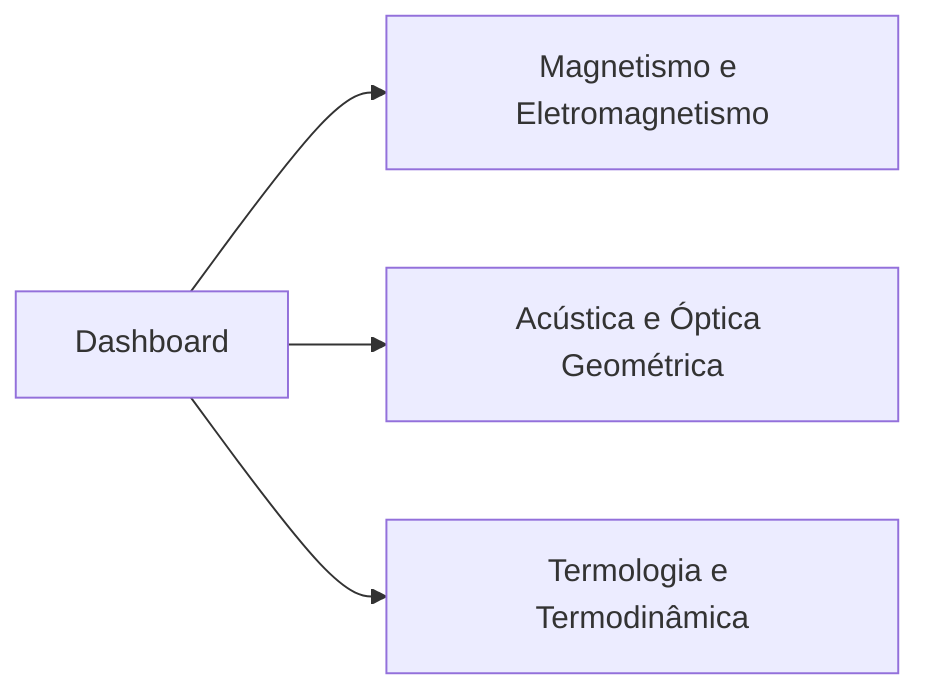

# 🎯 Painel de Controle - Semestre 2026.2

> [!abstract] Bem-vindo ao seu ambiente de ensino integrado no Obsidian. 
> Este painel unifica a sua rotina semanal base, o calendário do campus São José e a gestão pedagógica dos seus três cursos de Ensino Médio Integrado.

---

## ⚡ Atalhos Rápidos para os Cursos

- 🧲 **[[Magnetismo_Eletromag/Magnetismo_Eletromag|Magnetismo e Eletromagnetismo]]**
- 🔊 **[[Óptica_Acústica/Óptica_Acústica|Acústica e Óptica Geométrica]]**
- 🔥 **[[Termodinâmica/Termodinâmica|Termologia e Termodinâmica]]**

---

## 🗓️ Rotina Base Semanal

Esta é a sua grade padrão que guiará as semanas normais (sem feriados ou eventos especiais):

| Horário | Segunda-feira | Terça-feira | Quarta-feira | Quinta-feira | Sexta-feira |
| :--- | :--- | :--- | :--- | :--- | :--- |
| **07:30 - 09:20** | 🟢 Aula `FSC060805` | 🟢 Aula `FCA060905` | 📝 Escrita de Artigos | 📝 Escrita / Burocracias | ☕ Admin Leve |
| **09:40 - 11:00** | 🔴 Progressão / Org | 🔬 Estação Met. | 📝 Escrita de Artigos | 📝 Escrita / Progressão | 🟢 Aula `FCA060903` |
| **11:00 - 12:00** | 🔵 **Atendimento Alunos** | 🔬 Estação Met. | 📝 Escrita de Artigos | 📝 Escrita / Progressão | (Livre / Almoço) |
| **12:00 - 13:30** | (Almoço / Burocracias) | (Almoço) | (Almoço) | (Almoço) | (Almoço) |
| **13:30 - 14:10** | 🟢 Aula `FSC060804` | 🔬 Proj. Clayrton/Clarice | 📚 Proj. Como Estudar? | 🟡 Orientação TCC | 🟢 Aula `FSC060806` |
| **14:10 - 15:00** | 🟢 Aula `FSC060804` | 🧘 **Terapia (Patusco)** | 📚 Projetos / Revisão | 🟡 Orientação TCC | 🟢 Aula `FSC060806` |
| **15:00 - 15:40** | 🟢 Aula `FSC060804` | ☕ Organização / Leitura | 📚 Projetos / Revisão | 🟡 Orientação TCC | (Intervalo) |
| **15:40 - 17:00** | 🟡 Orientação (Fábio/Gouveia) | 🟠 Reunião CG | 📚 Projetos / Revisão | 🟡 Orientação TCC | 🟢 Aula `FCA060906` |
| **17:00 - 17:30** | 🟡 Orientação (Fábio/Gouveia) | 🟠 Reunião CG | 📚 Projetos / Revisão | 🔵 **Atendimento Alunos** | 🟢 Aula `FCA060906` |
| **18:30 - 22:30** | Livre | Livre | Livre | 🟢 Aula `PSJ0021 / 031802` | Livre |

---

## 📅 Calendário de Eventos e Bloqueios

Atenção especial às segundas-feiras, pois feriados frequentes exigirão remanejamento de atendimentos e orientações.

| Mês | Data(s) | Evento / Atividade (IFSC) | Ação Recomendada |
| :--- | :--- | :--- | :--- |
| **Julho** | 22/07 (Qua) | **Início do Semestre Letivo 2026.2** | Começar a aplicação da grade de rotina base. |
| **Setembro** | 07/09 (Seg) | 🔴 Feriado: Independência do Brasil | Sem atividades. **Remanejar TCCs e Atendimentos.** |
| **Setembro** | 12/09 (Sáb) | Sábado Letivo | Planejar reposição ou atividade extra se necessário. |
| **Outubro** | 05 a 09/10 | **Conselhos de Classe Intermediários** | Reduzir tempo de escrita/pesquisa na quarta. |
| **Outubro** | 12/10 (Seg) | 🔴 Feriado: N. Sra. Aparecida | Sem atividades. **Remanejar demandas de segunda.** |
| **Outubro** | 30/10 (Sex) | 🔴 Feriado: Dia do Servidor Público (Transferido de 28/10) | Sem atividades. Não há aulas de sexta-feira (FSC060806, FCA060903, FCA060906). |
| **Novembro** | 02/11 (Seg) | 🔴 Feriado: Dia de Finados | Sem atividades. **Quarta segunda-feira comprometida.** |
| **Novembro** | 07/11 (Sáb) | Sábado Letivo | Planejar atividade institucional. |
| **Novembro** | 20/11 (Sex) | 🔴 Feriado: Consciência Negra | Sem atividades. Não há aulas de sexta (Termo/Óptica). |
| **Dezembro** | 07 a 11/12 | **Conselhos de Classe Finais** | Reduzir tempo de escrita/pesquisa na quarta. |
| **Dezembro** | 11/12 (Sex) | **Fim do Semestre Letivo 2026.2** | Último dia de aulas com os alunos. |

---

> [!tip] **Gestão de Tarefas Dinâmica**
> Abaixo estão os painéis de aulas e avaliações que atualizam automaticamente conforme novas notas são criadas no vault:
> 
> ### 📅 Próximas Aulas
> ![[Calendario_Aulas.base#Cronograma Geral de Aulas]]
> 
> ### 📝 Avaliações Agendadas
> ![[Cronograma_Avaliacoes.base#Cronograma Geral de Avaliações]]
