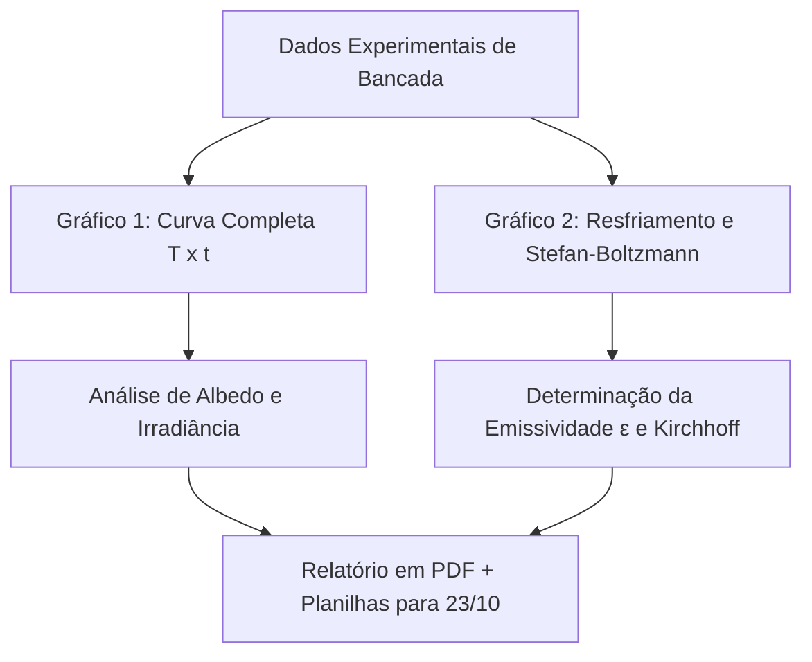

# 📊 Aula 11: Dúvidas, Exercícios e Roteiro de Construção dos Gráficos (02/10)

> [!important] **Orientações para as Turmas de Termodinâmica (FCA060903 e FSC060806)**
> Atendendo à solicitação das turmas, esta aula dedica-se ao esclarecimento de dúvidas conceituais do Bloco II e à apresentação das **diretrizes oficiais para a construção dos dois gráficos experimentais do Roteiro II (Radiação de Corpo Negro — Da Irradiância à Emissividade)**.
> 
> - **Prazo de Entrega:** Data da 2ª Avaliação (**23/10/2026**).
> - **Formato de Entrega:** Relatório com os gráficos finais em **formato PDF** + **Planilhas de dados originais** (ou scripts computacionais).
> - **Modalidade:** Em equipe (a mesma da bancada do laboratório).
> - **Material de Apoio:** [Baixar Roteiro Passo a Passo dos Gráficos (PDF)](file:///media/humba/Projetos/Meus_Projetos/ensino-ifsc/2026.2/termodinamica/Laboratorios/roteiro-construcao-graficos-radiacao.pdf) | [Roteiro Experimental II (PDF)](file:///media/humba/Projetos/Meus_Projetos/ensino-ifsc/2026.2/termodinamica/Laboratorios/Roteiro-II-Radia%C3%A7%C3%A3o-Corpo-Negro.pdf) | [Página Web da Aula 11](file:///media/humba/Projetos/Meus_Projetos/ensino-ifsc/2026.2/termodinamica/Aulas/Bloco-2/Aula11_2026-10-02/index.html)

---

## 🎯 Objetivos dos Dois Gráficos Experimentais

A prática realizada em 25/09 gerou dados térmicos de dois blocos de alumínio (preto fosco e branco fosco) submetidos a duas etapas distintas: **Aquecimento (0 a 14 min)** sob iluminação e **Resfriamento no escuro (14 a 28 min)**. Cada equipe deverá produzir e interpretar dois gráficos:



---

## 📈 Gráfico 1: Curva Completa de Aquecimento e Resfriamento ($T \times t$)

### 1. Especificações Técnicas
* **Eixo Horizontal ($X$):** Tempo ($t$) em minutos (0, 2, 4, ..., 28 min) ou segundos (0 a 1680 s).
* **Eixo Vertical ($Y$):** Temperatura ($T$) em graus Celsius ($^\circ\text{C}$) ou Kelvin ($\text{K}$).
* **Séries no mesmo gráfico:**
  1. Bloco Preto Fosco (curva/símbolos em destaque escuro, vermelho ou preto).
  2. Bloco Branco Fosco (curva/símbolos em destaque claro, azul ou cinza).
* **Linha demarcatória vertical ($t = 14\text{ min}$):** Indicar claramente a divisão entre:
  - **Fase 1 (0 a 14 min):** Lâmpada ligada — regime de aquecimento radiativo predominante.
  - **Fase 2 (14 a 28 min):** Lâmpada desligada — regime de resfriamento e dissipação térmica.

### 2. O que deve ser observado e discutido no Gráfico 1:
- A inclinação inicial da curva de aquecimento ($\frac{dT}{dt}$) do bloco preto é significativamente maior, evidenciando maior taxa de absorção de irradiância ($I_{\text{preto}} > I_{\text{branco}}$).
- A temperatura máxima atingida aos 14 minutos pelo bloco preto versus bloco branco (menor Albedo do bloco preto).

---

## 📉 Gráfico 2: Taxa de Resfriamento e Validação de Stefan-Boltzmann

Para o segundo gráfico, as equipes podem adotar uma das seguintes abordagens analíticas recomendadas:

### Opção A: Curva Detalhada de Resfriamento e Perda Térmica
* **Eixo $X$:** Tempo de resfriamento ($t_{\text{resf}} = 14$ a $28\text{ min}$).
* **Eixo $Y$:** Temperatura ($T$) ou queda térmica ($\Delta T = T(t) - T_A$).
* Permite comparar a inclinação de resfriamento inicial (entre 14 e 18 min), comprovando experimentalmente que o bloco preto perde calor mais rapidamente que o branco (validação direta da **Lei de Kirchhoff**).

### Opção B (Avançada/Recomendada): Potência Radiativa vs $(T^4 - T_A^4)$
* Pela **Lei de Stefan-Boltzmann**:
  $$P_{\text{resf}} = \varepsilon \cdot A_{\text{sup}} \cdot \sigma \cdot (T^4 - T_A^4)$$
* **Eixo $X$:** Termo de temperatura $(T^4 - T_A^4)$ em $\text{K}^4$.
* **Eixo $Y$:** Potência instantânea de resfriamento $P_{\text{resf}}$ em Watts ($\text{W}$).
* Ao ajustar uma linha de tendência linear que passa pela origem ($y = m \cdot x$), o coeficiente angular da reta é:
  $$m = \varepsilon \cdot A_{\text{sup}} \cdot \sigma \implies \varepsilon = \frac{m}{A_{\text{sup}} \cdot \sigma}$$

---

## 💻 Ferramentas e Softwares Permitidos

Os alunos têm total liberdade para utilizar a ferramenta com a qual tenham maior afinidade ou interesse profissional:

### 1. Planilhas Eletrônicas (Google Sheets / Microsoft Excel / LibreOffice Calc)
* **Regra Fundamental:** Escolha sempre **Gráfico de Dispersão ($X \times Y$)** com marcadores de pontos conectados por linhas suaves.
* *Nunca use "Gráfico de Linhas simples"*, pois ele trata o tempo como texto/categoria e distorce o espaçamento temporal.
* Utilize a ferramenta de **Linha de Tendência** para extrair a equação e o $R^2$.

### 2. Softwares Científicos de Plotagem e Análise
* **OriginLab / SciDAVis:** Excelentes para ajuste linear de Stefan-Boltzmann, gráficos com padrão de publicação científica e controle fino dos eixos.
* **Gnuplot:** Leve, scripts reproduzíveis e exportação vetorial de altíssima qualidade.

### 3. Computação Científica (Python / GNU Octave / MATLAB)
* **Python (Matplotlib / Seaborn):**
  ```python
  import matplotlib.pyplot as plt

  tempo = [0, 2, 4, 6, 8, 10, 12, 14, 16, 18, 20, 22, 24, 26, 28]
  t_preto = [...]  # Seus dados coletados
  t_branco = [...]

  plt.figure(figsize=(9, 5))
  plt.plot(tempo, t_preto, 'ro-', label='Bloco Preto Fosco', lw=2)
  plt.plot(tempo, t_branco, 'bs--', label='Bloco Branco Fosco', lw=2)
  plt.axvline(x=14, color='gray', linestyle=':', label='Lâmpada Desligada (14 min)')
  plt.title('Curva de Aquecimento e Resfriamento — Lab Radiação de Corpo Negro')
  plt.xlabel('Tempo (min)')
  plt.ylabel('Temperatura (°C)')
  plt.grid(True, alpha=0.3)
  plt.legend()
  plt.tight_layout()
  plt.savefig('grafico1_corpo_negro.pdf')
  ```
* **GNU Octave / MATLAB:**
  ```matlab
  t = [0:2:28];
  plot(t, T_preto, 'r-o', t, T_branco, 'b--s', 'LineWidth', 1.5);
  xline(14, '--k', 'Lâmpada Desligada');
  xlabel('Tempo (min)'); ylabel('Temperatura (°C)');
  legend('Bloco Preto', 'Bloco Branco'); grid on;
  ```

---

## 📋 Checklist de Qualidade dos Gráficos

Antes de gerar o PDF final, certifique-se de que os gráficos contêm:
- [ ] Título claro e explicativo no topo ou na legenda da figura.
- [ ] Identificação dos dois eixos com a grandeza física e sua respectiva unidade entre parênteses: ex. `Tempo (min)` e `Temperatura (°C)`.
- [ ] Pontos experimentais claramente identificáveis com símbolos distintos.
- [ ] Legenda explicativa distinguindo o bloco preto do bloco branco.
- [ ] Grade de fundo (*grid*) visível e discreta para facilitar a leitura.
- [ ] Escalas numéricas coerentes e bem distribuídas nos eixos.

---

## 📦 Instruções de Entrega

* **Data limite:** **23/10/2026** (no início da aula presencial da 2ª Avaliação).
* **O que deve ser entregue:**
  1. **Documento em PDF:** Contendo a folha de rosto da equipe, a tabela de dados preenchida, os 2 gráficos impressos/diagramados com alta resolução e as respostas conceituais das perguntas do roteiro.
  2. **Planilha Eletrônica ou Script:** O arquivo `.xlsx`, `.ods`, `.py` ou `.m` utilizado para gerar os gráficos.
* **Critério de Avaliação:** A clareza visual, o rigor na identificação das grandezas/unidades e a correlação física das curvas com os conceitos de Albedo, Kirchhoff e Stefan-Boltzmann compõem a pontuação laboratorial do Bloco II.

---

## 🔗 Navegação
- ⬅️ Aula anterior: [[Termodinâmica/Aulas/Bloco-2/Aula10_2026-09-25/Aula10_2026-09-25|Aula 10 — Lab 02: Radiação de Corpo Negro]]
- 🏠 [[Termodinâmica/Termodinâmica|Plano de Ensino (Hub de Termodinâmica)]]
- ➡️ Próxima aula: [[Termodinâmica/Aulas/Bloco-2/Aula12_2026-10-09/Aula12_2026-10-09|Aula 12 — Ausência Docente (Tratamento de Saúde)]]
